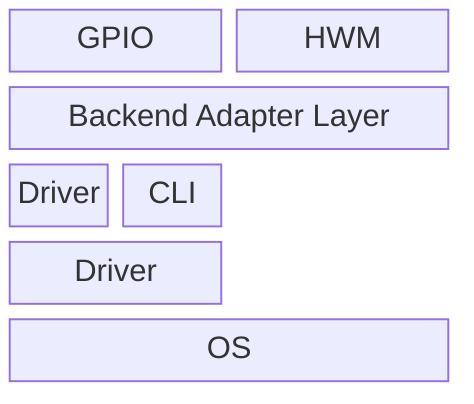

# mermaid-hq-png-export

Render Mermaid diagrams to high-resolution PNG with sharp text (not upscaled from an old PNG).

## What this skill does

- Re-renders Mermaid source via Kroki (`.mmd -> .svg`)
- Ensures labels stay visible by using Mermaid init config with `flowchart.htmlLabels=false`
- Converts SVG to PNG with `ffmpeg` at a target scale (for example 2x, 4x, 8x)

## Repository structure

- `SKILL.md`: Skill instructions and workflow
- `agents/openai.yaml`: Codex skill metadata
- `scripts/render_mermaid_png.py`: CLI renderer script

## Requirements

- Python 3
- `curl`
- `ffmpeg`
- Network access to `https://kroki.io`

## Usage

```bash
python3 scripts/render_mermaid_png.py \
  --input /abs/path/diagram.mmd \
  --output /abs/path/diagram-4x.png \
  --scale 4
```

## Chat usage (direct prompt)

In Codex chat, you can directly send Mermaid content and ask for high-resolution PNG output, for example:

````text


輸出成高解析png
````

The agent should render and output a high-resolution PNG directly from this prompt.

### Options

- `--input`: Mermaid source file (`.mmd`)
- `--output`: Output PNG path
- `--scale`: Scale factor from SVG `viewBox` (default: `4.0`)
- `--keep-svg`: Optional path to save the intermediate SVG

## Example

```bash
python3 scripts/render_mermaid_png.py \
  --input ./examples/arch.mmd \
  --output ./out/arch-8x.png \
  --scale 8 \
  --keep-svg ./out/arch-8x.svg
```

## Notes

- This workflow produces native high-resolution output from source, not interpolation from an existing PNG.
- If rendering fails with network/DNS errors, retry in an environment with internet access.
