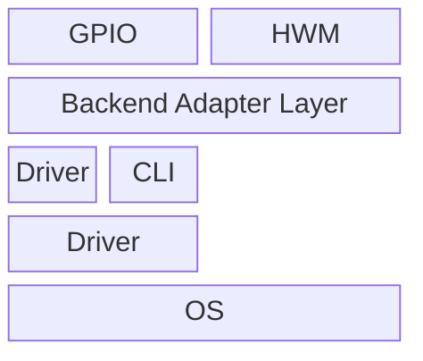

# mermaid-hq-png-export

Render Mermaid diagrams to high-resolution PNG with sharp text (not upscaled from an old PNG).

## What this skill does

- Re-renders Mermaid source via Kroki or local `mmdc` (`.mmd -> .svg`)
- Ensures labels stay visible by using Mermaid init config with `flowchart.htmlLabels=false`
- Converts SVG to PNG with `ffmpeg` at a target scale (for example 2x, 4x, 8x)
- Supports batch export for multiple `.mmd` files in one command

## Repository structure

- `SKILL.md`: Skill instructions and workflow
- `agents/openai.yaml`: Codex skill metadata
- `scripts/render_mermaid_png.py`: CLI renderer script

## Requirements

- Python 3
- `ffmpeg`
- One Mermaid render backend:
  - `curl` + network access to `https://kroki.io` (Kroki backend)
  - or local `mmdc` in PATH (offline/local backend)

## Usage

```bash
python3 scripts/render_mermaid_png.py \
  --input /abs/path/diagram.mmd \
  --output /abs/path/diagram-4x.png \
  --scale 4 \
  --backend auto
```

## Batch usage

```bash
python3 scripts/render_mermaid_png.py \
  --batch-dir /abs/path/mermaid-files \
  --output-dir /abs/path/png-output \
  --pattern '*.mmd' \
  --recursive \
  --scale 4 \
  --backend auto
```

## Chat usage (direct prompt)

In Codex chat, you can directly send Mermaid content and ask for high-resolution PNG output, for example:

````text


Export to high-resolution PNG.
````

The agent should render and output a high-resolution PNG directly from this prompt.

### Options

- `--backend`: `auto` (default), `kroki`, or `mmdc`
- `--input`: Mermaid source file (`.mmd`, single mode)
- `--output`: Output PNG path (single mode)
- `--scale`: Scale factor from SVG `viewBox` (default: `4.0`)
- `--keep-svg`: Optional path to save the intermediate SVG (single mode)
- `--batch-dir`: Input directory for batch mode
- `--output-dir`: Output directory for batch mode
- `--pattern`: Batch file pattern (default: `*.mmd`)
- `--recursive`: Recursively search `--batch-dir`
- `--name-suffix`: Output filename suffix in batch mode (default: `-hq`)
- `--keep-svg-dir`: Optional directory to save batch SVG files

## Example

```bash
python3 scripts/render_mermaid_png.py \
  --input ./examples/arch.mmd \
  --output ./out/arch-8x.png \
  --scale 8 \
  --backend auto \
  --keep-svg ./out/arch-8x.svg
```

## Notes

- This workflow produces native high-resolution output from source, not interpolation from an existing PNG.
- `--backend auto` tries Kroki first, then falls back to local `mmdc`.
- If Kroki rendering fails due to network, use `--backend mmdc` for local/offline rendering.
