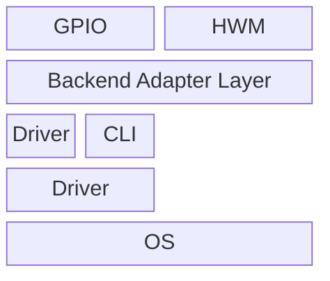

# mermaid-hq-png-export

Render Mermaid diagrams to high-resolution PNG with sharp text (not upscaled from an old PNG).

## What this skill does

- Defaults to local `mmdc` for PNG rendering (`.mmd -> .png`)
- Auto-installs `mmdc` locally when missing
- Adds `kroki-local`, a local CLI/backend intended to stay close to Kroki Mermaid output
- Falls back in this order: `mmdc` -> `kroki-local` -> Kroki
- For high-resolution PNG requests, prefer `mmdc` or `kroki-local`
- Use remote `kroki` only when Kroki output is explicitly required
- Provides an explicit bootstrap step so the skill does not assume the installer already has the correct local package versions
- Supports batch export for multiple `.mmd` files in one command

## Repository structure

- `SKILL.md`: Skill instructions and workflow
- `agents/openai.yaml`: Codex skill metadata
- `scripts/render_mermaid_png.py`: CLI renderer script

## Requirements

- Python 3
- Runtime:
  - Default path (`mmdc`) auto-installs local dependencies under `~/.local/mermaid-hq-png-export`
  - `kroki-local` needs a local Chromium/Chrome executable
  - Kroki path needs `curl` + network access to `https://kroki.io`
  - Current `kroki` backend fetches PNG directly from remote Kroki
  - If `--keep-svg` is used with `kroki`, the script fetches remote SVG separately and saves it locally
- For automatic Node.js bootstrap (when system Node is absent): `curl` and `tar`

## Install bootstrap

Install and verify the pinned local renderer dependencies up front:

```bash
python3 scripts/bootstrap_renderer_env.py
```

This bootstrap step installs or verifies:
- local Node.js
- `mmdc`
- `kroki-local` pinned dependencies
- Mermaid `11.12.3`
- `puppeteer-core 23.11.1`

## Usage

```bash
python3 scripts/render_mermaid_png.py \
  --input /abs/path/diagram.mmd \
  --output /abs/path/diagram-4x.png \
  --scale 4
```

## Batch usage

```bash
python3 scripts/render_mermaid_png.py \
  --batch-dir /abs/path/mermaid-files \
  --output-dir /abs/path/png-output \
  --pattern '*.mmd' \
  --recursive \
  --scale 4
```

## Chat usage (direct prompt)

In Codex chat, you can directly send Mermaid content and ask for high-resolution PNG output, for example:

````text


Export to high-resolution PNG.
````

The agent should render and output a high-resolution PNG directly from this prompt.

Backend selection rule:
- If the user asks for a high-resolution PNG, prefer `mmdc` first, then `kroki-local`.
- If the user explicitly asks for `kroki`, use `kroki` and warn that remote PNG size is fixed; `--scale` will not change it.

### Options

- `--backend`: `mmdc` (default), `kroki-local`, `kroki`, or `auto`
- `--input`: Mermaid source file (`.mmd`, single mode)
- `--output`: Output PNG path (single mode)
- `--scale`: Scale factor for local backends (`mmdc`, `kroki-local`). Remote `kroki` PNG output ignores local scaling.
- `--keep-svg`: Optional path to save the intermediate SVG (single mode)
- `--batch-dir`: Input directory for batch mode
- `--output-dir`: Output directory for batch mode
- `--pattern`: Batch file pattern (default: `*.mmd`)
- `--recursive`: Recursively search `--batch-dir`
- `--name-suffix`: Output filename suffix in batch mode (default: `-hq`)
- `--keep-svg-dir`: Optional directory to save batch SVG files

## Example

```bash
python3 scripts/render_mermaid_png.py \
  --input ./examples/arch.mmd \
  --output ./out/arch-8x.png \
  --scale 8 \
  --keep-svg ./out/arch-8x.svg
```

Kroki-style local backend:

```bash
python3 scripts/render_mermaid_png.py \
  --backend kroki-local \
  --input ./examples/arch.mmd \
  --output ./out/arch-kroki-local.png \
  --scale 4
```

## Regression tests

```bash
python3 tests/run_regression_tests.py
```

Expected:
- `mmdc_flowchart_text`: PASS
- `kroki_flowchart_text`: PASS
- `kroki_local_flowchart_text`: PASS
- `kroki_local_block_beta_geometry`: PASS
- `mmdc_flowchart_html_style`: PASS
- `kroki-local_block_beta_html_style`: PASS

## Notes

- This workflow produces native high-resolution output from source, not interpolation from an existing PNG.
- `kroki-local` keeps Kroki-like SVG generation, but PNG output is produced by browser screenshot instead of `ffmpeg`. This preserves flowchart labels even when the SVG still contains `foreignObject`.
- `kroki` PNG output now comes directly from remote Kroki instead of local `ffmpeg` rasterization. This keeps the backend aligned with actual Kroki PNG behavior, especially for tested `block-beta` cases.
- In the current regression suite, remote direct Kroki PNG also removes the earlier flowchart text-loss seen with `remote SVG + local rasterize`.
- When `backend=kroki`, the script prints a warning if `--scale` is not `1`, because remote Kroki PNG size is returned as-is.
- `kroki-local` uses a local CLI and aims to stay close to Kroki Mermaid geometry, but exact parity can still depend on Chromium/font environment.
- `kroki-local` pins Mermaid to `11.12.3` to stay aligned with the Kroki version verified during development, and regression tests check that installed version.

## Design Notes

These implementation choices are based on direct experiments against `mmdc`, remote Kroki, and local Kroki-style rendering:

- Early `kroki-local` PNG output used `SVG -> ffmpeg/librsvg -> PNG`.
  - Result: some flowcharts lost labels in PNG.
- Native `mmdc` PNG output kept labels visible on the same flowchart case.
  - Its SVG still contained `foreignObject`, so the success was not caused by removing `foreignObject`.
  - The important difference was PNG generation in the browser via screenshot.
- Adding `XMLSerializer` normalization alone did not fix missing text.
  - It made the SVG more XML-safe, but node labels still remained `foreignObject`.
- Changing `kroki-local` PNG output to browser screenshot fixed the flowchart text-loss case.
  - This is now the default `kroki-local` PNG path.
- A later HTML-style experiment showed that globally injecting `flowchart.htmlLabels=false` was too aggressive.
  - It caused `block-beta` labels to render raw HTML tags instead of styled content.
  - It also pushed remote `kroki` flowcharts back toward the text-loss path.
  - The skill no longer injects `flowchart.htmlLabels=false` by default.
- A later Kroki comparison showed that remote direct PNG matches real Kroki behavior better than `remote SVG + local rasterize`.
  - The skill therefore no longer uses local `ffmpeg` for the `kroki` backend.
- Mermaid version materially affects layout.
  - `kroki-local` with Mermaid `11.12.3` stays much closer to current Kroki output than `11.13.0`.
  - The skill therefore pins `kroki-local` Mermaid to `11.12.3`.
