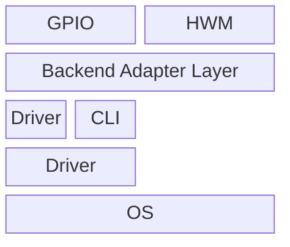

# mermaid-hq-png-export

Render Mermaid diagrams to high-resolution PNG with sharp text (not upscaled from an old PNG).

## What this skill does

- Defaults to local `mmdc` for PNG rendering (`.mmd -> .png`)
- Auto-installs `mmdc` locally when missing
- Falls back to Kroki only if `mmdc` install is unavailable
- Ensures labels stay visible by using Mermaid init config with `flowchart.htmlLabels=false`
- Supports batch export for multiple `.mmd` files in one command

## Repository structure

- `SKILL.md`: Skill instructions and workflow
- `agents/openai.yaml`: Codex skill metadata
- `scripts/render_mermaid_png.py`: CLI renderer script

## Requirements

- Python 3
- Runtime:
  - Default path (`mmdc`) auto-installs local dependencies under `~/.local/mermaid-hq-png-export`
  - Kroki path needs `curl` + `ffmpeg` + network access to `https://kroki.io`
- For automatic Node.js bootstrap (when system Node is absent): `curl` and `tar`

## Usage

```bash
python3 scripts/render_mermaid_png.py \
  --input /abs/path/diagram.mmd \
  --output /abs/path/diagram-4x.png \
  --scale 4
```

## Batch usage

```bash
python3 scripts/render_mermaid_png.py \
  --batch-dir /abs/path/mermaid-files \
  --output-dir /abs/path/png-output \
  --pattern '*.mmd' \
  --recursive \
  --scale 4
```

## Chat usage (direct prompt)

In Codex chat, you can directly send Mermaid content and ask for high-resolution PNG output, for example:

````text


Export to high-resolution PNG.
````

The agent should render and output a high-resolution PNG directly from this prompt.

### Options

- `--backend`: `mmdc` (default), `kroki`, or `auto`
- `--input`: Mermaid source file (`.mmd`, single mode)
- `--output`: Output PNG path (single mode)
- `--scale`: Scale factor from SVG `viewBox` (default: `4.0`)
- `--size-reference`: `kroki` (default), `mmdc`, `cross`, or `none` for dimension alignment when `--target-width` is not set
- `--target-width`: Optional fixed output width in pixels (single or batch mode). Set `0` to disable.
- `--keep-svg`: Optional path to save the intermediate SVG (single mode)
- `--batch-dir`: Input directory for batch mode
- `--output-dir`: Output directory for batch mode
- `--pattern`: Batch file pattern (default: `*.mmd`)
- `--recursive`: Recursively search `--batch-dir`
- `--name-suffix`: Output filename suffix in batch mode (default: `-hq`)
- `--keep-svg-dir`: Optional directory to save batch SVG files

## Example

```bash
python3 scripts/render_mermaid_png.py \
  --input ./examples/arch.mmd \
  --output ./out/arch-8x.png \
  --scale 8 \
  --size-reference kroki \
  --keep-svg ./out/arch-8x.svg
```

## Regression tests

```bash
python3 tests/run_regression_tests.py
```

Expected:
- `mmdc_flowchart_text`: PASS
- `mmdc_target_width`: PASS
- `kroki_flowchart_text`: XFAIL (known limitation for this flowchart case)
- `kroki_target_width`: PASS (when Kroki is reachable)

## Notes

- This workflow produces native high-resolution output from source, not interpolation from an existing PNG.
- In this skill, `flowchart` diagrams are safest with `mmdc` because Kroki+ffmpeg can lose text on some cases.
- With default `--size-reference kroki`, `mmdc` output dimensions are aligned to Kroki for per-diagram consistency.
